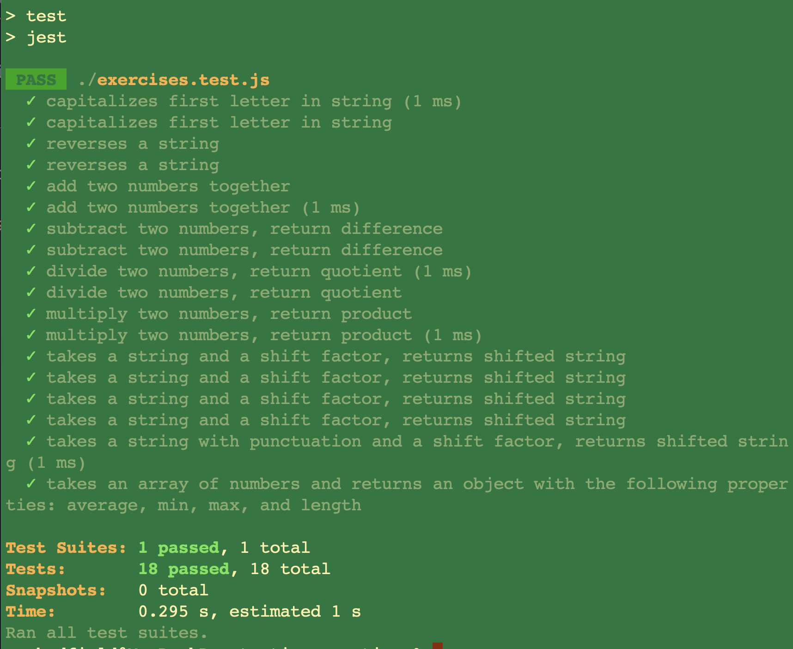
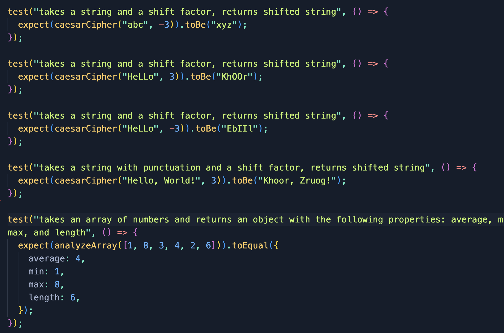

# 🧪 Testing Practice

'Testing Practice' project for The Odin Project curriculum

## 🗣️ Description

Serves as practice for Test Driven Development (TDD) within the web development domain.

## 💻 Technologies Used

- JavaScript
- Jest
- NPM

## 🏃 To Run

```
git clone https://github.com/samsdevlab/testing-practice.git
npm install
npm install --save-dev jest
```

(Note: This project is configured to use ES Module syntax for Jest.)

To run test:

`npm test`

## 📸 Screenshots




